# Scan2Hire (Kaizen Job Portal)

[](https://v0-kaizen-job-portal.vercel.app/)
[](https://github.com/kmithileshhhhh05/OnlineJobPortal)

**Scan2Hire** is the **Kaizen Job Portal** project built for **August Fest 2025**.  
It’s a **QR-powered platform** that instantly connects **students** and **companies**:
- Students complete a short assessment and publish a digital profile.
- Companies post jobs and get a **unique QR** for each listing.
- Anyone can **scan** to view the job/profile and **express interest in one click**.
- An **AI fitment engine** computes a **match score** to prioritize the best candidates.

---

## Key Features
- **Student Assessment** → values, preferences, personality, resume
- **AI Fitment Scoring** → quick compatibility score for recruiters
- **QR Codes** → scannable links for job posts & profiles
- **Phone Verification** → basic authenticity checks
- **Company Directory** → browse & filter companies
- **Voice Input** → Web Speech API for hands-free form filling
- **Dark/Light Theme** → theme toggle
- **Responsive UI** → mobile-first
- **LocalStorage Demo Data** → works without a backend

---

##  Tech Stack
- **Frontend**: Next.js (App Router), React, Tailwind CSS
- **UI**: shadcn/ui components
- **State / Data (demo)**: LocalStorage
- **AI (optional)**: Pluggable LLM for fitment summaries
- **QR**: `qrcode` npm library
- **Deploy**: Vercel

---

##  Quick Start

### 1) Prerequisites
- Node.js ≥ 18
- PNPM or NPM

### 2) Clone & Install
git clone https://github.com/kmithileshhhhh05/OnlineJobPortal

cd Scan2Hire
pnpm install         # or: npm install

---


## **Complete Project Structure & File Overview**

### ** Project Structure:**

```plaintext
Scan2Hire(kaizenjobportal)/
├── app/
│   ├── layout.tsx                 # Root layout with theme provider
│   ├── page.tsx                   # Homepage with hero section
│   ├── globals.css                # Global styles and Tailwind
│   ├── student/
│   │   ├── page.tsx              # Multi-step career assessment
│   │   └── results/
│   │       └── page.tsx          # Career recommendations with AI matching
│   ├── company/
│   │   └── page.tsx              # Job posting form with QR generation
│   ├── companies/
│   │   └── page.tsx              # Browse all companies (FIXED!)
│   └── job/
│       └── [id]/
│           ├── page.tsx          # Job details with phone verification
│           └── fitment/
│               └── page.tsx      # AI fitment score calculation
├── components/
│   ├── theme-provider.tsx        # Dark/light theme context
│   ├── theme-toggle.tsx          # Theme switcher component
│   └── ui/                       # Shadcn/ui components (40+ components)
├── hooks/
│   └── use-toast.ts              # Toast notification hook
├── lib/
│   └── utils.ts                  # Utility functions (cn, etc.)
└── public/
    └── images/                   # Static assets
 ```   

### **🔧 What Each File Contains:**

#### **Core App Files:**

- **`app/layout.tsx`**: Root layout with metadata, theme provider, and toast notifications
- **`app/page.tsx`**: Landing page with hero section, features, stats, and navigation
- **`app/globals.css`**: Tailwind CSS imports and custom styles

#### **Student Journey:**

- **`app/student/page.tsx`**: 5-step assessment form (Basic Info → Values → Preferences → Personality → Resume)
- **`app/student/results/page.tsx`**: AI-powered career recommendations with match scores and job listings

#### **Company Journey:**

- **`app/company/page.tsx`**: Job posting form with voice input, preview, and QR code generation
- **`app/companies/page.tsx`**: **[NEWLY ADDED]** Browse all companies with filtering and search

#### **Job System:**

- **`app/job/[id]/page.tsx`**: Job details page with phone verification and interest tracking
- **`app/job/[id]/fitment/page.tsx`**: AI-powered fitment analysis with detailed scoring

#### **UI Components:**

- **`components/theme-toggle.tsx`**: Dark/light mode switcher
- **`components/ui/`**: 40+ Shadcn/ui components (buttons, cards, forms, etc.)

---

##  Key Features Implemented:

**Student Assessment** :  5-step form with validation  
**AI Career Matching** : Intelligent recommendations based on values/preferences  
**QR Code Generation** : Real functional QR codes using `qrcode` library  
**Phone Verification** : Student profile checking system  
**Fitment Analysis** : AI-powered compatibility scoring  
**Company Directory**  : Browse and filter companies (**FIXED!**)  
**Voice Input**  : Web Speech API integration  
**Dark Theme** : Complete dark/light mode support  
**Responsive Design** : Mobile-first approach  
**Data Persistence** : LocalStorage for demo purposes  

---

##  Future Enhancements:

1. **Database Integration**: Replace localStorage with Supabase/PostgreSQL
2. **Real Authentication**: Add proper user auth with sessions
3. **Email Notifications**: Send updates to students and companies
4. **Advanced AI**: Integrate with OpenAI for better matching algorithms
5. **File Upload**: Proper resume parsing and storage
6. **Analytics Dashboard**: Track application success rates
7. **Video Interviews**: Integrate video calling for remote interviews
8. **Skill Assessments**: Add coding challenges and skill tests
9. **Company Profiles**: Detailed company pages with culture info
10. **Mobile App**: React Native version for mobile users

---

##  Application Snapshots:
- 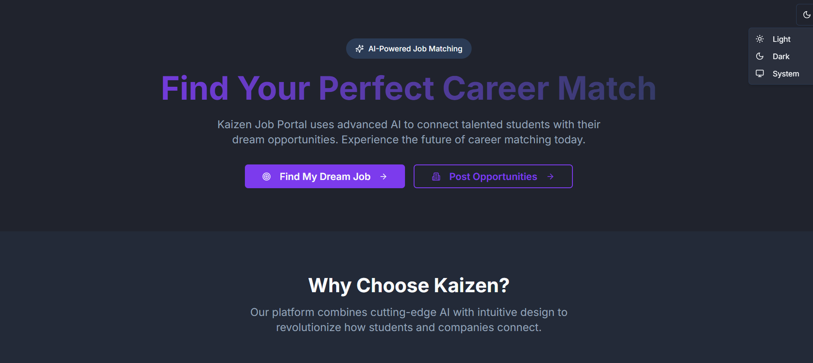
- 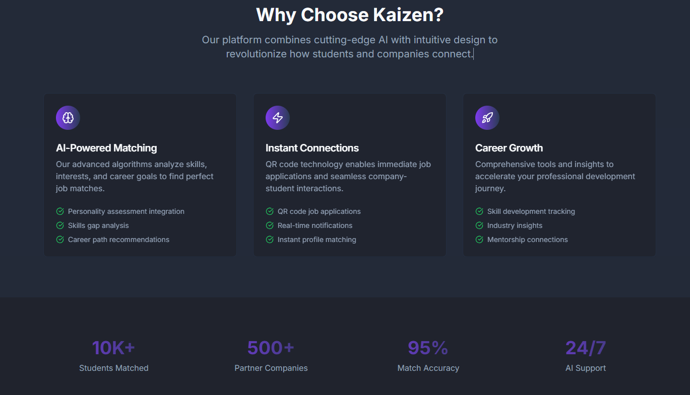
- 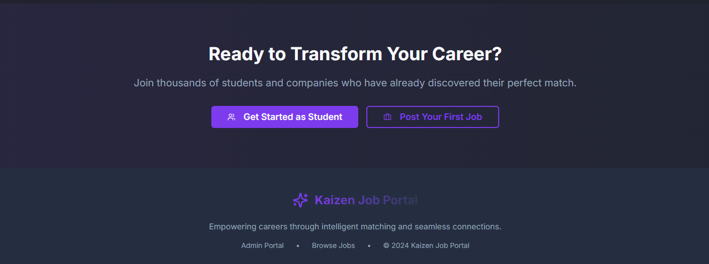
- 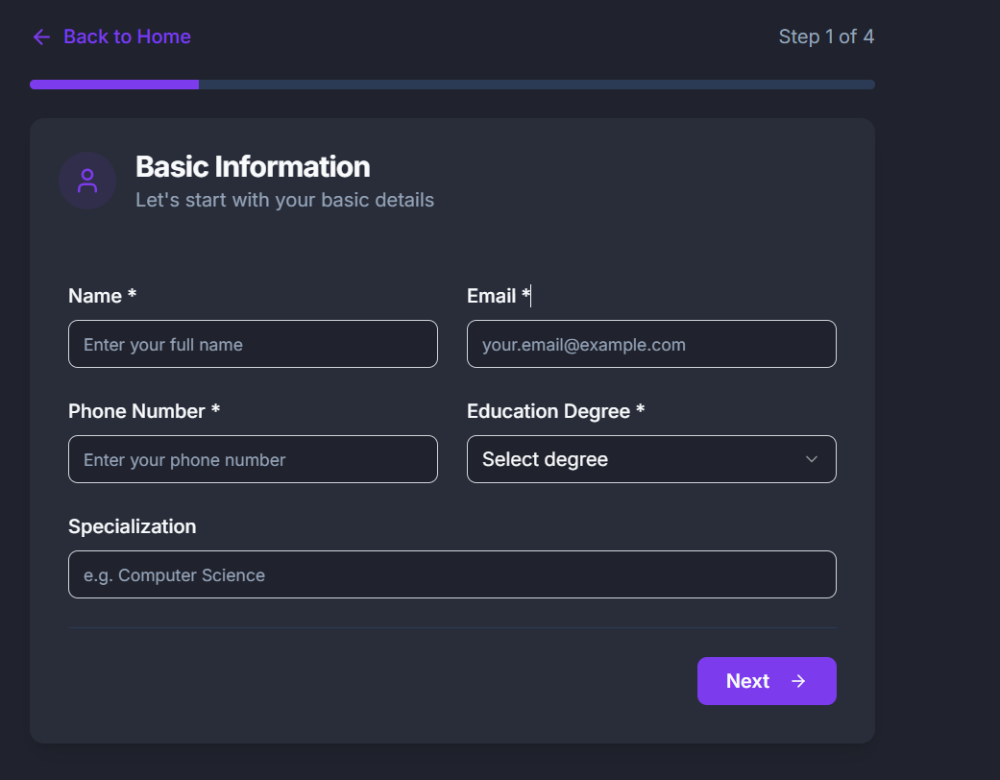
- 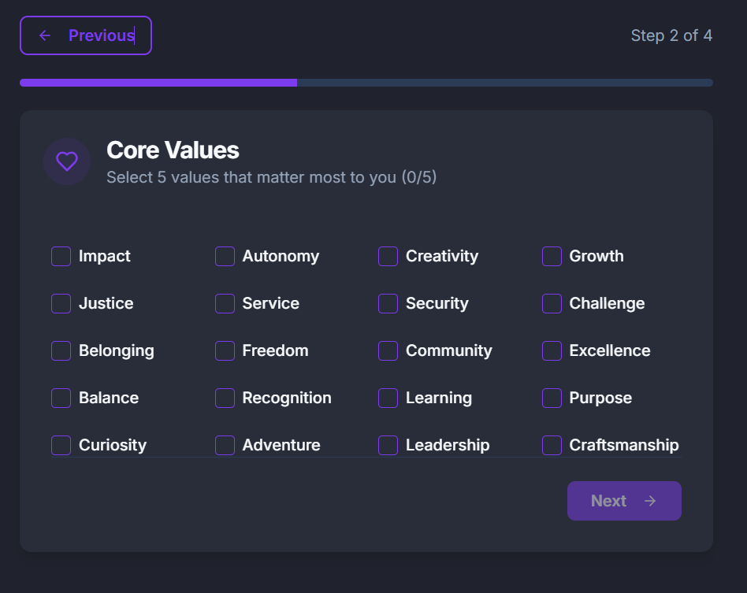
- 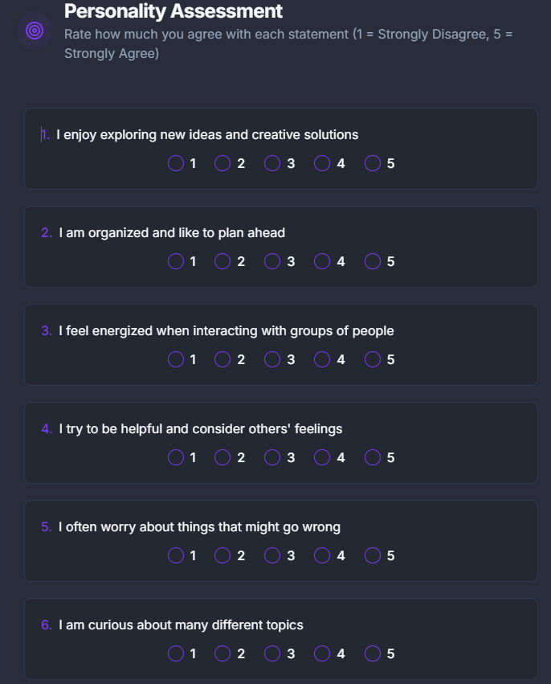
- 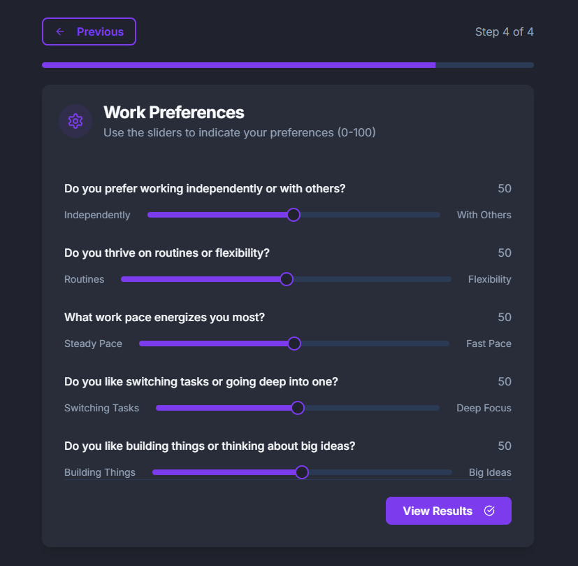
- 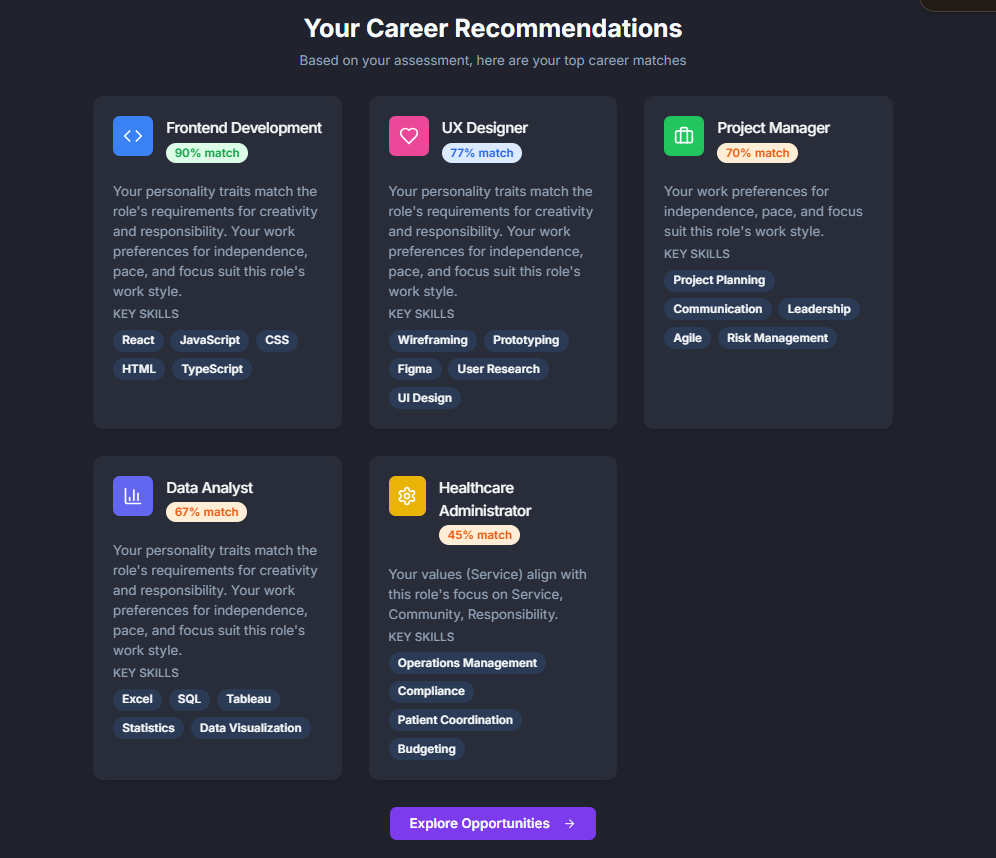
- 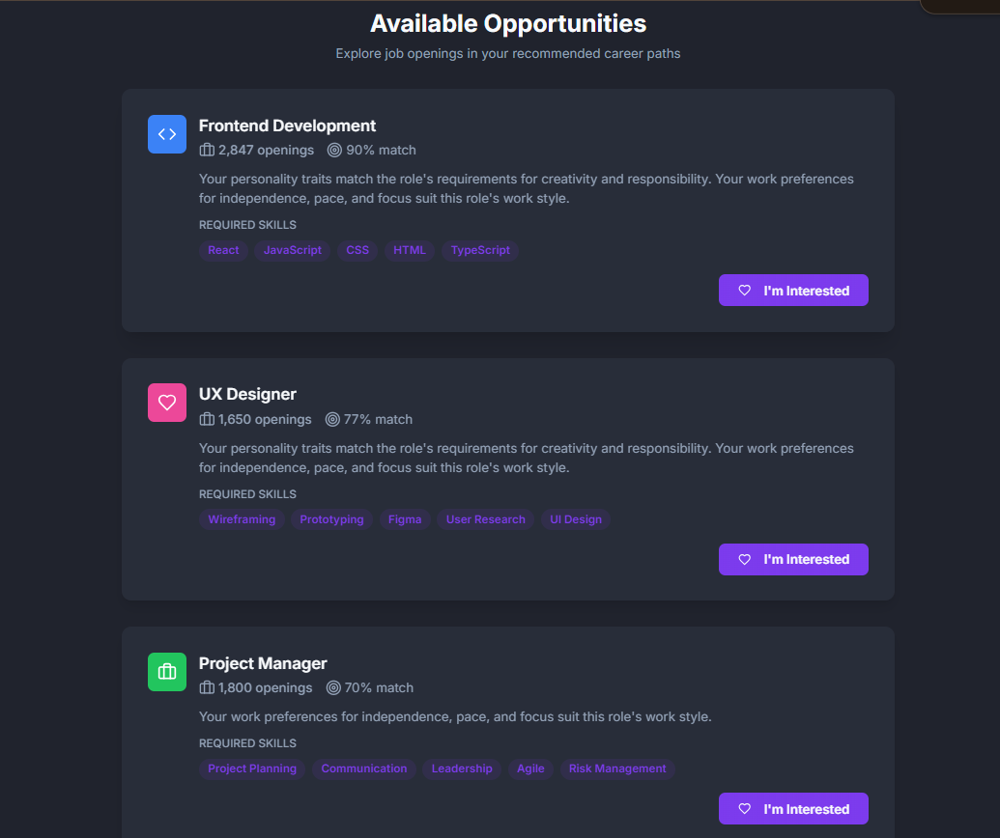
- 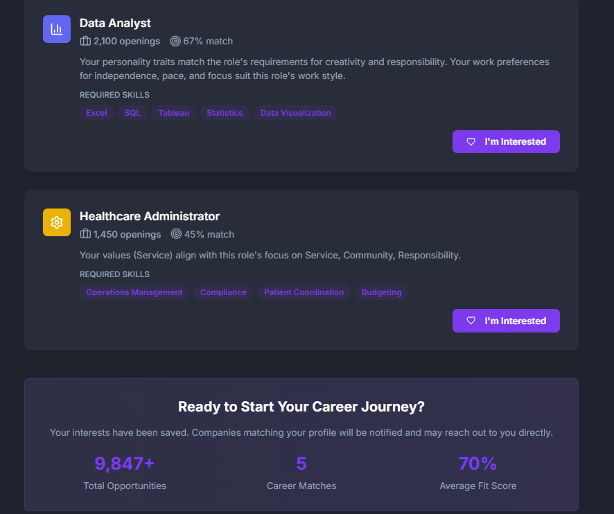
- 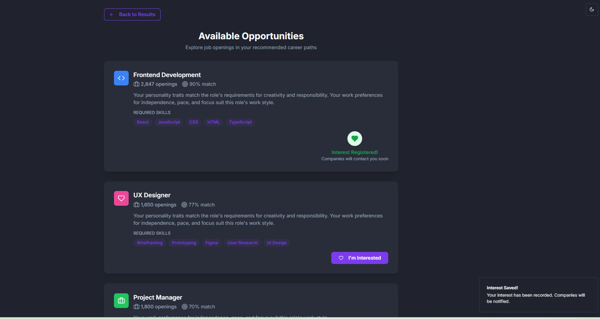
- 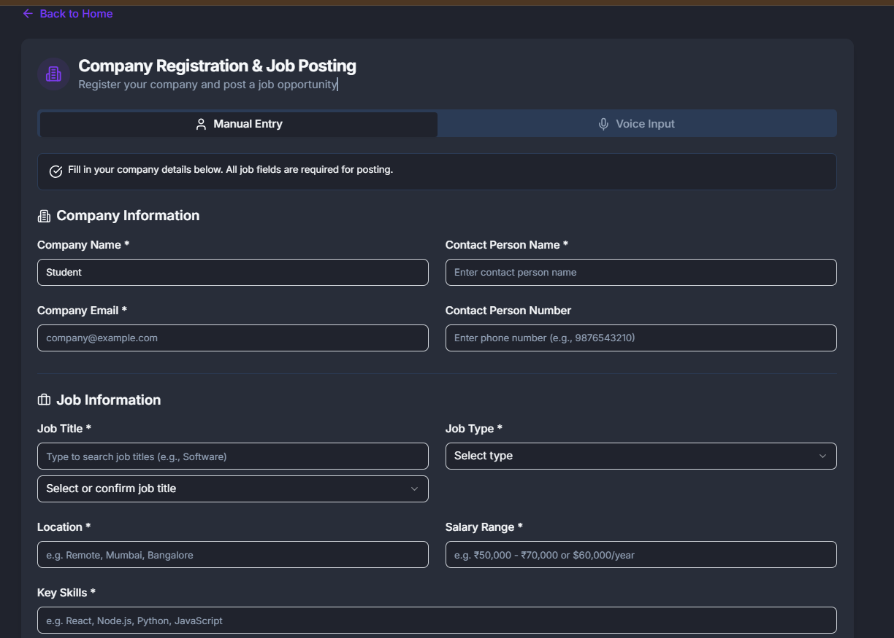
- 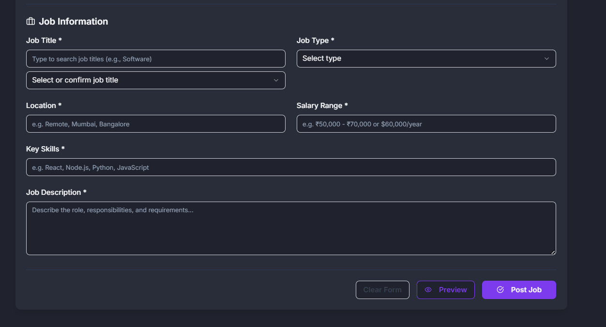
- 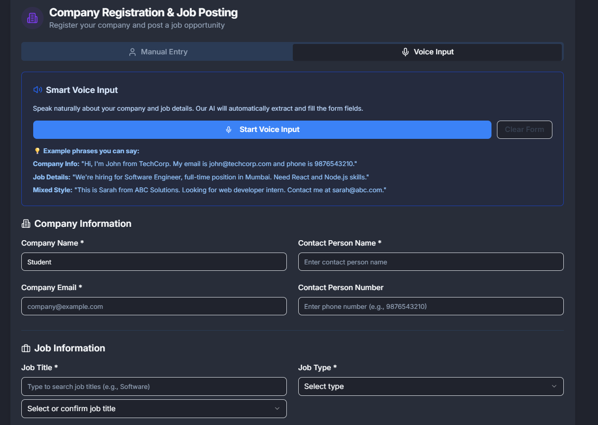
- 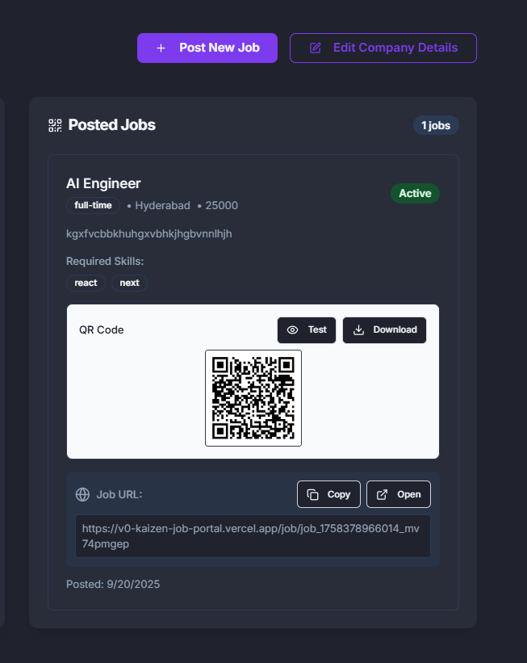
- 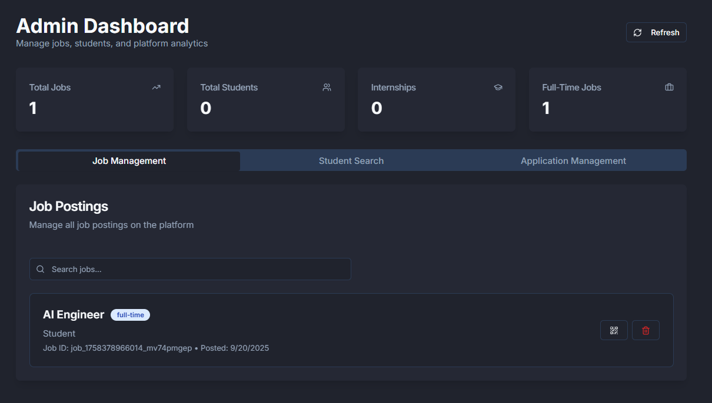

##  Deployment

- **Frontend** deployed on **Vercel**: [https://v0-kaizen-job-portal.vercel.app/](https://v0-kaizen-job-portal.vercel.app/)
- **GitHub Repository**: [https://github.com/kmithileshhhhh05/OnlineJobPortal](https://github.com/kmithileshhhhh05/OnlineJobPortal)
